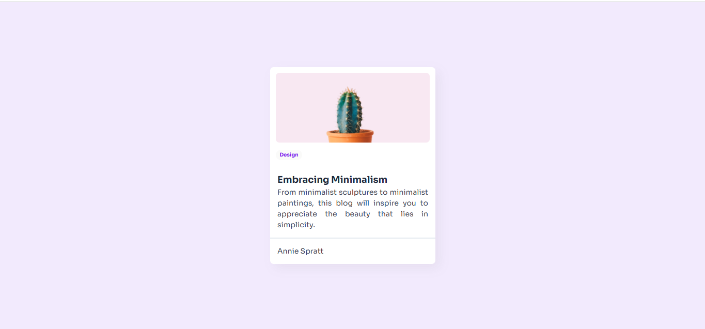

<!-- Please update value in the {}  -->

<h1 align="center">Minimal Blog Card | devChallenges</h1>

   Solution for a challenge <a href="https://devchallenges.io/challenge/minimal-blog-card" target="_blank">Minimal Blog Card</a> from <a href="http://devchallenges.io" target="_blank">devChallenges.io</a>.

  <h3>
    <a href="https://marvelous-scone-2dd204.netlify.app/">
      Demo
    </a>
     | 
    <a href="https://github.com/mohammadshbeeb11/Devchallengesio/tree/main/Minimal-blog-card-starter-master">
      Solution
    </a>
     | 
    <a href="https://devchallenges.io/challenge/minimal-blog-card">
      Challenge
    </a>
  </h3>

<!-- TABLE OF CONTENTS -->

## Table of Contents

- [Overview](#overview)
- [Built with](#built-with)
- [Author](#author)

<!-- OVERVIEW -->

## Overview

### Built with

- Semantic HTML5 markup
- CSS custom properties
- Flexbox

## Author

- GitHub [@mohammadshbeeb11](https://github.com/mohammadshbeeb11)
