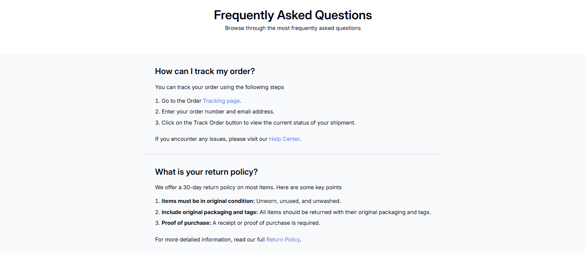

<!-- Please update value in the {}  -->

<h1 align="center">Simple FAQ Page | devChallenges</h1>

   Solution for a challenge <a href="https://devchallenges.io/challenge/simple-faq-challenge" target="_blank">Simple FAQ</a> from <a href="http://devchallenges.io" target="_blank">devChallenges.io</a>.

  <h3>
    <a href="{https://your-demo-link.your-domain}">
      Demo
    </a>
     | 
    <a href="{https://your-url-to-the-solution}">
      Solution
    </a>
     | 
    <a href="https://devchallenges.io/challenge/simple-faq-challenge">
      Challenge
    </a>
  </h3>

<!-- TABLE OF CONTENTS -->

## Table of Contents

- [Overview](#overview)
- [Built with](#built-with)
- [Author](#author)

<!-- OVERVIEW -->

## Overview

### Built with

- Semantic HTML5 markup
- CSS custom properties
- CSS Grid

## Author

- GitHub [@your-username](https://{github.com/your-usermame})